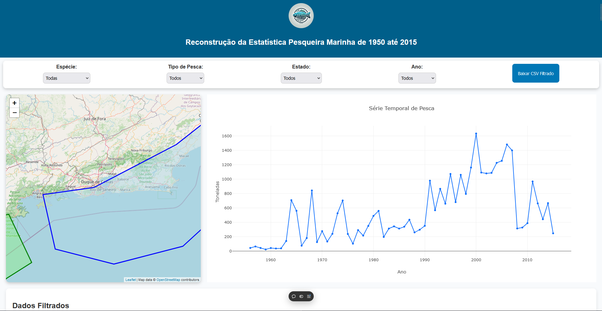

# RECONPESQ

> Este projeto oferece um painel interativo para explorar dados pesqueiros históricos de 1950 a 2015. Ele combina mapa, gráfico e tabela para filtrar e analisar a produção em diferentes regiões e espécies.

### Ajustes e melhorias

O projeto ainda está em desenvolvimento, algumas tarefas já foram realizar e as próximas atualizações também podem ser vistas na lista geral a seguir:

- [x] Filtros para acessar dados selecionados
- [x] Gráfico de Séries Temporais
- [x] Adição de Mapa Interativo
- [x] Versão Responsiva
- [ ] Resumo de Metodologias por Espécie
- [ ] Combinação de Múltiplos Agentes para Interpretar Dados

Adicione comandos de execução e exemplos que você acha que os usuários acharão úteis. Forneça uma referência de opções para pontos de bônus!

## 🤝 Colaboradores

Agradecemos às seguintes pessoas que contribuíram para este projeto: Ministério da Pesca e Agricultura do Brasil, FAPESE, DCOMP, DPAQ e UFS.

